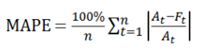
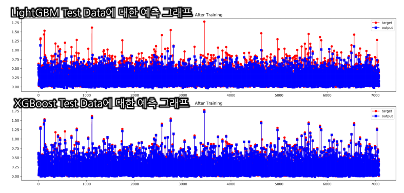
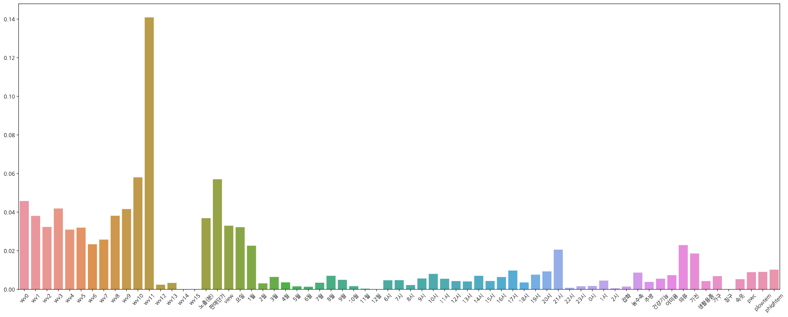

# BIG CONTEST

**2020 빅콘테스트 데이터분석분야 챔피언리그**

------

### 대회 개요

기업에서 실제 보유하고 있는 데이터를 자유롭게 활용하여 **새로운 비즈니스 모델 및 참신한 아이디어를 제시**하고, 빅데이터 인재발굴을 통한 **청년 취업 기회를 제공**하고자 합니다.

> 빅콘테스트 홈페이지 : https://www.bigcontest.or.kr/

### 최종 목표

> 1. NS SHOP+ 편성 데이터를 활용해 요일별 / 시간대별 / 카테고리별 프로그램 취급액 예측
> 2. 편성표 최적화 모델 제시

- **활용데이터**

1. NS SHOP+ 프로그램 편성 별 실적 데이터
2. 요일 / 시간대별 분단위 시청률 데이터
3. 기상청 중기 예보 (육상예보, 기온) 데이터

- **평가지표**

1. 평균 절대 비율 오차 (MAPE : Mean Absolute Percentage Error)
   

- **분석내용**

1. 분석 프로세스

| 프로세스             | 방법                                                         |
| -------------------- | ------------------------------------------------------------ |
| 실적 데이터 전처리 1 | 편성시간 결측치 보간, 무형 제품 결측치 제거                  |
| 실적 데이터 전처리 2 | 상품군, 방송 월 / 시간대, 평일 or 주말 범주형 데이터 처리    |
| 실적 데이터 전처리 3 | 상품명에 대한 자연어처리 분석 (Max Length = 16 벡터화)       |
| 시청률 데이터 전처리 | 연 평균 시청률 데이터를 활용, 일시, 편성 시간에 맞춰 시청률 계산 |
| 기상 데이터 전처리   | 3일 뒤 예보 데이터를 활용해 하늘 상태(맑음, 비), 최저/최고 기온 계산 |
| 최종 학습 데이터     | **학습 데이터** 35,379 x **Feature** 67                      |
| 모델 학습            | GridSearchCV기반 LightGBM, XGBoost 모델 학습                 |

2. Modeling

| Model        | 코멘트                                                       |
| ------------ | ------------------------------------------------------------ |
| XGBoost      | 학습시간이 LightGBM 보다 느리지만 모델의 학습 정확도가 높음  |
| LightGBM     | XGBoost에 비해 학습속도가 빠름, 하지만 전체적인 경향성만 파악 |
| GridSearchCV | Hyper Parameter 5개를 각각 3개씩, 총 243가지 경우에 대해서 학습 |
| K-Fold       | 특정 데이터에 편향되지 않게 학습, Cross-Validation = 5       |

- **분석결과**

1. 모델 별 Train, Test SET에 대한 MAPE / 학습시간

| MODELS      | Train-MAPE | TEST-MAPE  | 학습시간   |
| ----------- | ---------- | ---------- | ---------- |
| LightGBM    | -43%       | -45%       | **57.0분** |
| **XGBoost** | **-14.2%** | **-14.0%** | 417.9분    |

2. Test SET에 대한 모델의 예측 그래프

3. XGBoost Best Parametor Model Feature Importances

- **Insight**

1. LSTM 같은 시계열 분석 뿐 아니라 매출액 예측을 다양한 평가변수로 시도해봄으로써, 매출액을 예측하는 전반적인 프로세스를 이해하게 됨
2. EDA(탐색적 데이터 이해)를 통해 데이터 활용 방안에 대한 목표를 세우는 것 뿐 아니라 데이터를 어떻게 활용할 것인지 Insight를 얻는 것이 중요하다는 것을 깨달음
3. 수치형 변수와 범주형 변수에 대한 차이와 활용 방법, 그리고 평가 지표, 모델에 따라 정규화해야하는 변수와 하지 않아야 될 것을 구분하게 됨

- **아쉬운점**

1. 요일별 시청률 평균을 사용하지 않음 (연간 시청률 평균을 사용함)

2. 단어 트렌드 분석을 진행하지 못함
   인스타그램 등 SNS 해시 태그를 분석해 트렌드 예측
   예 1) ‘30대 화장품’, ‘연예인 화장품’ 등 키워드로 총 80만 개의 해시 태그를 분석
   예 2) 코로나와 같은 상황적 이슈에 대한 분석
3. 범주형 변수로 상품 소분류 상품 대분류를 활용하지 않음
4. 상품 정보를 입력받아 최적의 편성표를 제시하는 시뮬레이션 프로그램 미완성

